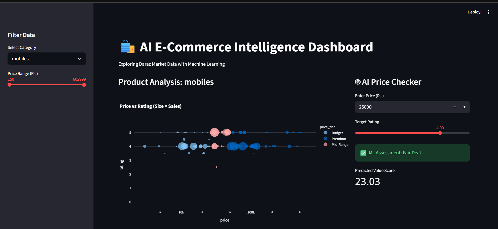
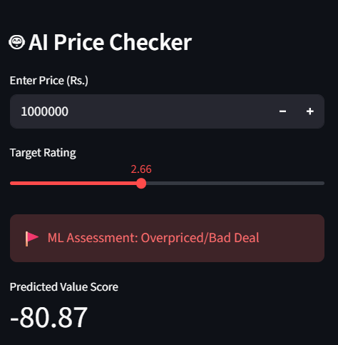
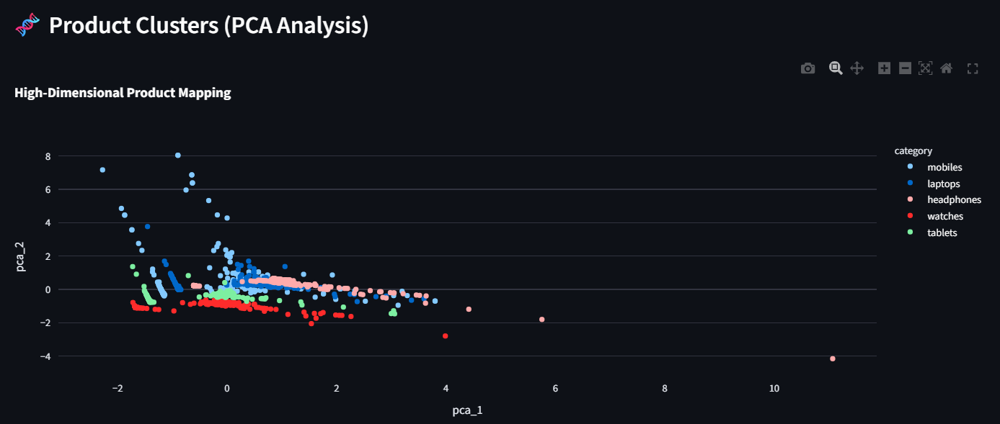
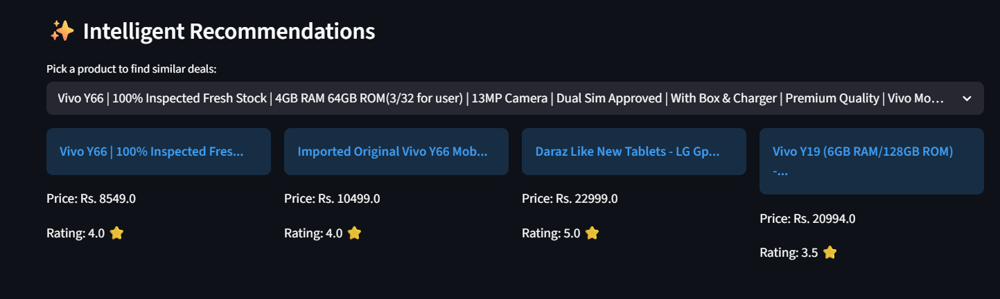

# Data-Driven E-Commerce Intelligence

[](LICENSE) [](https://www.python.org/) [](https://streamlit.io/)

An end-to-end toolkit that collects, cleans, analyzes, models, and visualizes e-commerce product data. The system performs product analytics, predicts estimated product value, detects potentially overpriced listings, and provides similarity-based recommendations through an interactive Streamlit dashboard.

Table of contents
-----------------
- [Overview](#overview)
- [Quick start](#quick-start)
- [Repository layout](#repository-layout)
- [Data schema](#data-schema)
- [Methodology](#methodology)
- [Models & Outputs](#models--outputs)
- [Deployment](#deployment)
- [Future work](#future-work)
- [Contributing](#contributing)
- [License](#license)
- [Contact](#contact)

Overview
--------
In modern e-commerce marketplaces, users face information overload, inconsistent pricing, and difficulty assessing true product value. This project builds a data-driven system to collect live product listings, clean and transform them, run statistical analyses and machine learning models, and present insights in an interactive dashboard so users can make smarter purchase decisions.

## Dashboard Preview

### Interactive Analytics Dashboard


### AI Price Prediction


### PCA Product Clustering


### Product Recommendation System


## Project Workflow

```text
E-Commerce Website
        |
        ↓
scraper.py
(Data Collection)
        |
        ↓
data/raw_products.csv
        |
        ↓
clean.py
(Data Cleaning & Preprocessing)
        |
        ↓
data/clean_products.csv
        |
        ↓
eda.py
(Exploratory Data Analysis)
        |
        ↓
features.py
(Feature Engineering + PCA)
        |
        ↓
train_models.py
(Machine Learning Models)
        |
        ↓
models/*.pkl
        |
        ↓
app.py
(Streamlit Dashboard)
```

Quick start
-----------
Setup (Windows):

```powershell
python -m venv .venv
.venv\Scripts\activate
pip install -r requirements.txt
```

Run the main pipeline (recommended order):

```powershell
python scraper.py      # collect raw data
python clean.py        # clean and normalize
python eda.py          # exploratory analysis and plots
python features.py     # build features for modeling
python train_models.py # train and save models
python app.py          # start the Streamlit dashboard / inference app
```

## Repository Layout

```text
Ecommerce-Project/
│
├── scraper.py
├── clean.py
├── eda.py
├── features.py
├── train_models.py
├── app.py
│
├── data/
│   ├── raw_products.csv
│   ├── clean_products.csv
│   └── features_ready.csv
│
├── models/
│   ├── model.pkl
│   └── scaler.pkl
│
├── plots/
│   └── visualization outputs
│
└── README.md
```

Data schema (typical)
---------------------
- `product_id` — string
- `title` — string
- `description` — string
- `price` — float
- `currency` — string
- `brand` — string
- `category` — string
- `rating` — float
- `reviews` — int
- `sold_count` — int
- `url` — string

Methodology
-----------
1. Data acquisition: Scrape product listings (Daraz and similar) capturing price, rating, reviews, sold counts, and metadata.
2. Cleaning & preprocessing: Remove duplicates, fix types, impute or drop missing entries, and standardize textual fields.
3. Feature engineering: Create value scores, price tiers, encode categoricals, and scale numeric features with `StandardScaler`.
4. Dimensionality reduction: Use PCA for visualization and to power similarity-based recommendations.
5. Modeling: Fit Linear Regression for value estimation, Logistic Regression for overpriced classification, and K-Nearest Neighbors for recommendations.
6. Evaluation & visualization: Produce price distributions, ratings-vs-price plots, correlation heatmaps, and PCA cluster visuals.

## Technologies Used

### Programming
- Python

### Data Collection
- Selenium
- WebDriver Manager

### Data Processing
- Pandas
- NumPy

### Visualization
- Matplotlib
- Seaborn
- Plotly

### Machine Learning
- Scikit-learn
- PCA
- Regression Models
- Classification Models

### Deployment
- Streamlit

## Models & Outputs
- Value estimation (Linear Regression): predicts an expected value/score for a product.
- Overpriced detection (Logistic Regression): classifies listings as `overpriced` vs `fair`.
- Recommendations (KNN): finds similar products based on engineered features or PCA embeddings.
- Visual outputs: price distribution, ratings vs price scatter, correlation heatmap, PCA clusters, and a Streamlit interface for interactive exploration.

Deployment
----------
The Streamlit dashboard (`app.py`) bundles model inference and visualizations into an interactive web app. Run `python app.py` and open the provided local URL. For production, consider containerizing the app and deploying to a cloud service (Heroku, AWS Elastic Beanstalk, Azure App Service).

## Key Results

- Built a complete automated e-commerce data pipeline
- Processed and transformed raw product data into ML-ready features
- Developed predictive models for product valuation and pricing analysis
- Created recommendation functionality using similarity-based modeling
- Developed an interactive dashboard for business insights

## Future work
- Expand scraping across multiple marketplaces (Amazon, Alibaba, etc.) for broader datasets.
- Add advanced models (Random Forest, XGBoost, neural networks) to improve predictions.
- Add sentiment analysis on reviews (NLP) to augment numeric ratings.
- Implement real-time price tracking and alerting for deals.
- Add CI, tests, and automated experiment tracking (MLflow, Weights & Biases).

Contributing
------------
Contributions are welcome. Please open an issue to discuss major changes, add tests for deterministic functions, and submit PRs with clear descriptions. Use a feature branch and include reproducible examples when possible.

License
-------
This project is licensed under the MIT License — see the [LICENSE](LICENSE) file.


## Author

**Maryam Bano**

Email: maryambano.official@gmail.com

GitHub: https://github.com/Realmaryambano
