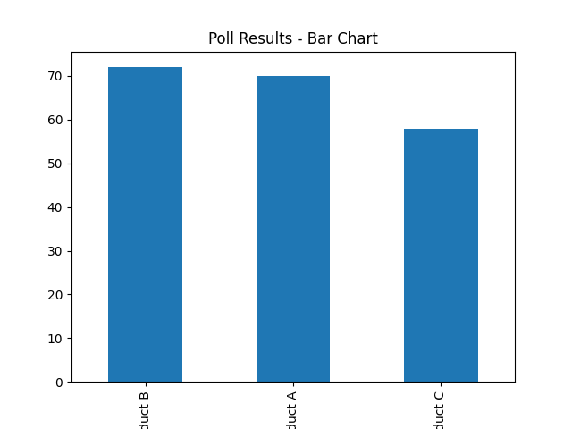
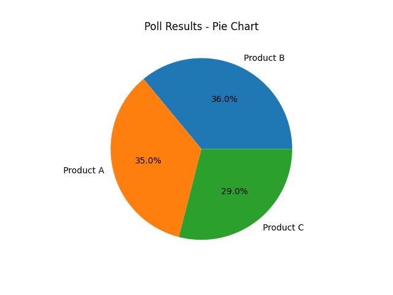
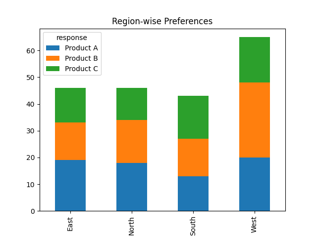

 Poll Results Visualizer

 Overview

The Poll Results Visualizer is a data analysis project that transforms raw survey or poll data into meaningful insights using visualizations and statistical analysis.

This project simulates real-world polling systems used by organizations to analyze customer feedback, election trends, and product preferences.


 Problem Statement

Raw survey data is often difficult to interpret and does not directly provide actionable insights.

Organizations need a system that:

* Processes poll data efficiently
* Visualizes results clearly
* Generates meaningful insights for decision-making


 Solution

This project provides an end-to-end pipeline that:

* Generates or loads poll data
* Cleans and preprocesses the dataset
* Performs statistical analysis
* Visualizes results using charts
* Generates insights automatically


 Features

*  Synthetic poll data generation
*  Data cleaning and preprocessing
*  Vote count and percentage analysis
*  Region-wise and demographic analysis
*  Visualizations:

  * Bar charts
  * Pie charts
  * Stacked charts
*  Automated insight generation
*  Organized modular code structure


 Tech Stack

* Python
* Pandas
* NumPy
* Matplotlib


 Project Structure

```
Poll-Results-Visualizer/
│
├── data/
├── notebooks/
├── src/
├── outputs/
├── images/
├── README.md
├── requirements.txt
└── main.py
```

 How to Run

 Clone Repository


cd Poll-Results-Visualizer


 Create Virtual Environment

python -m venv venv
venv\Scripts\activate   # Windows
source venv/bin/activate # Mac/Linux


 Install Dependencies

pip install -r requirements.txt

 Run Project

python main.py


 Results

The project generates:

* Bar Chart (vote counts)
*  Pie Chart (percentage distribution)
*  Region-wise comparison chart

 Example Insight:

> Most preferred option is Product A with highest percentage of votes.


 Screenshots


 Bar Chart



 Pie Chart



Region-wise Analysis




 Key Learnings

* Data cleaning and preprocessing techniques
* Exploratory Data Analysis (EDA)
* Data visualization best practices
* Insight generation from structured data
* Modular project design


Future Improvements

* Add Streamlit interactive dashboard
* Support multiple poll questions
* Add real-time data integration
* Deploy as a web application


